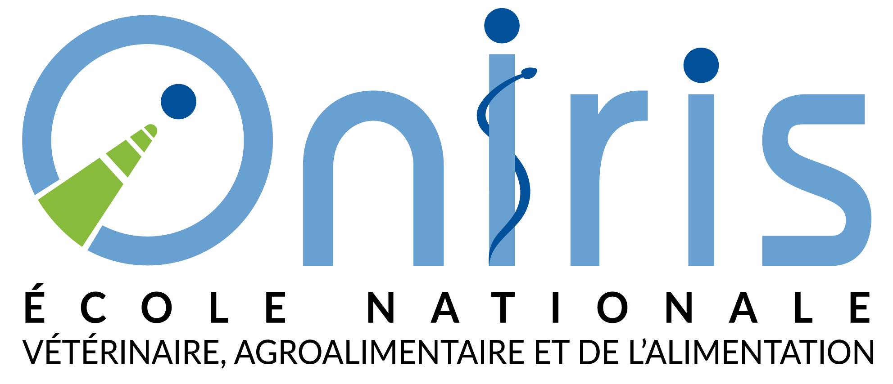
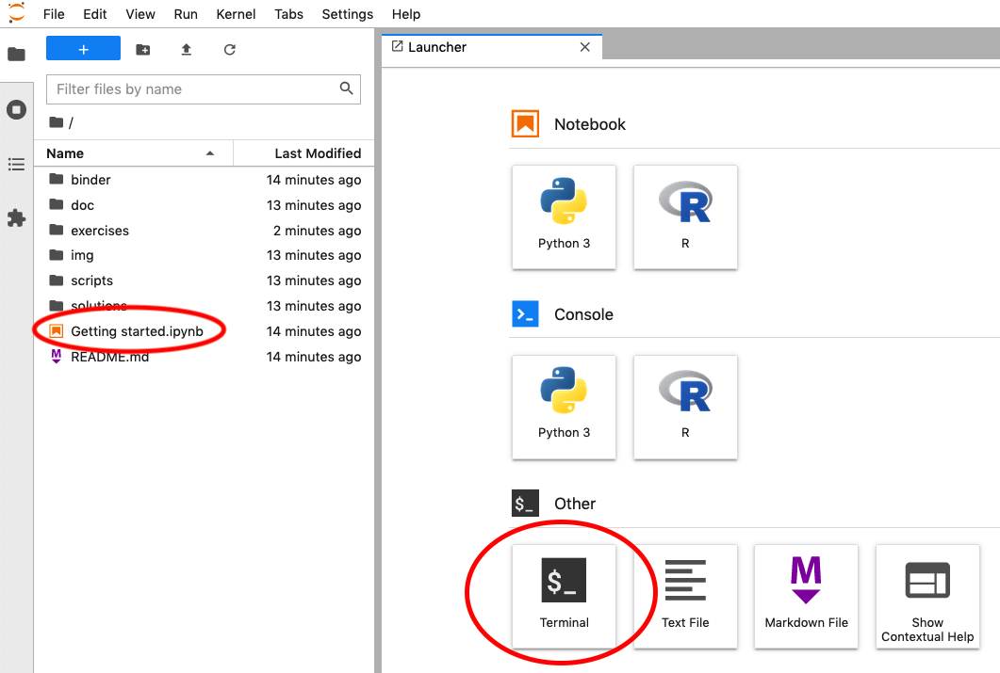
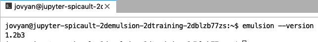
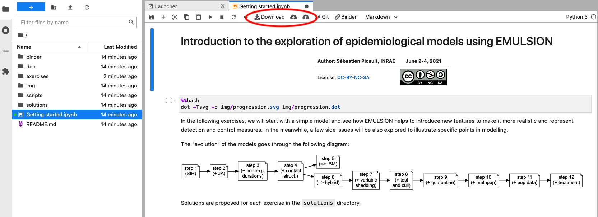
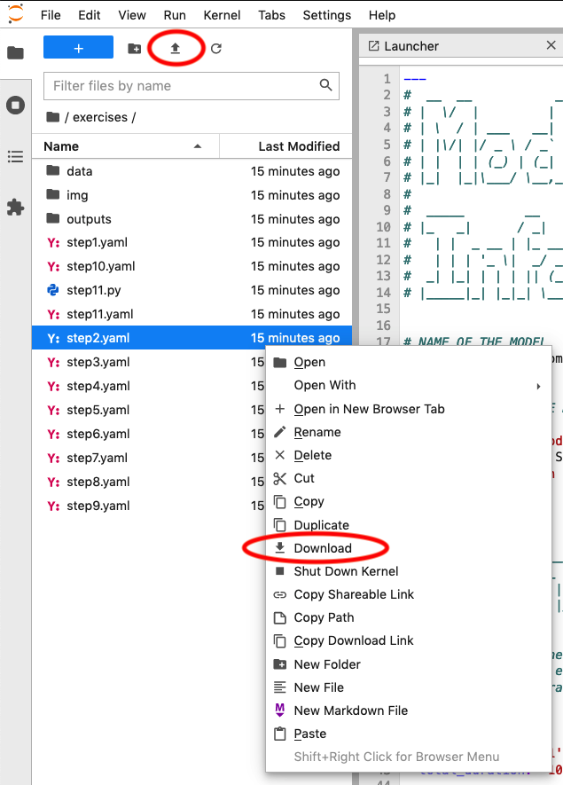
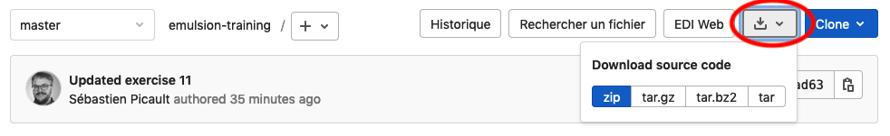
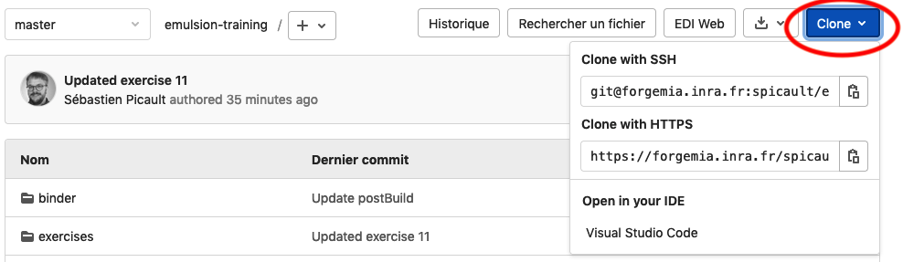

# Introduction to the exploration of epidemiological models using EMULSION

| Author: **Sébastien Picault, INRAE** | June 2-4, 2021 |
|---|---|
| License: [CC-BY-NC-SA](https://en.wikipedia.org/wiki/Creative_Commons_license) |  |

This training (see details [here](https://sourcesup.renater.fr/www/emulsion-public/EGAAL2021/)) is part of the doctoral formation proposed at the EGAAL doctoral school.


<table>
    <tr>
        <td style="padding: 25px;"></td>
        <td style="padding: 25px;"></td>
        <td style="padding: 25px;"></td>
        <td style="padding: 25px;"></td>
    </tr>
</table>
</span>

## Documentation for EMULSION 1.2b3

The documentation for this version is available [here](https://spicault.pages.mia.inra.fr/emulsion-training/)

---

## Software configuration for the training

Exercises can be run either on your own machine on through a virtual environment provided by [Binder](https://mybinder.readthedocs.io/en/latest/).


### Solution 1: do everything on-line

We provide a pre-configured virtual environment thanks to Binder, which ensures that all participants work with the same software environment.

This on-line environment can be launched by clicking this button: [](https://mybinder.org/v2/git/https%3A%2F%2Fforgemia.inra.fr%2Fspicault%2femulsion-training/HEAD?urlpath=lab)

When the environment is built, you should get the following environment:



- Open a terminal and type:

```bash
emulsion --version
```

Your configuration is correct if you get this:




- You can also test the notebook


**IMPORTANT NOTES:**

- At the very first time, Binder has to build the virtual environment before launching it, which takes some time (about 10 minutes). After that, the Binder environment is cached, hence taking only 1-2 min to launch
- The Binder environment is **ephemeral**, with a short timeout period (about 10 min). Thus, you have to periodically save (download) the files you modify (e.g. EMULSION model files, or possibly the notebook), to be able to restore them after a break.

> You can either **download** the notebook on your machine or download/upload its state through your web browser




> You can also download/upload the exercises (YAML files) on your
> machine




---

### Solution 2: install on your own machine

Choose this approach if you are already familiar with software installation on your machine.

1. Download this repository (see button above) or clone it with `git`
   (`git clone
   https://forgemia.inra.fr/spicault/emulsion-training.git`)

   - Download: 
   - Clone: 

2. Install and test EMULSION version **1.2b3** (with Graphviz) on your own machine following the [installation instructions](https://spicault.pages.mia.inra.fr/emulsion-training/pages/Install.html) and the [section regarding development versions](https://spicault.pages.mia.inra.fr/emulsion-training/pages/Install.html#alternative-2-install-development-version).
3. For the exercises, follow the instructions provided in the notebook [Getting started](Getting%20started.ipynb). By default, this notebook will be displayed in a read-only mode. To have it work interactively, you need to install [Jupyter lab](https://jupyter.org/) on your machine.
4. To run the exercises themselves, copy-paste commands in your favourite terminal.


---

## Additional resources

- [EMULSION website](https://sourcesup.renater.fr/www/emulsion-public) and [software paper](https://doi.org/10.1371/journal.pcbi.1007342)
- [DYNAMO team](https://www6.angers-nantes.inrae.fr/bioepar/Equipes/DYNAMO)
- follow us:
  [](http://twitter.com/intent/follow?screen_name=bioepar_dynamo)
